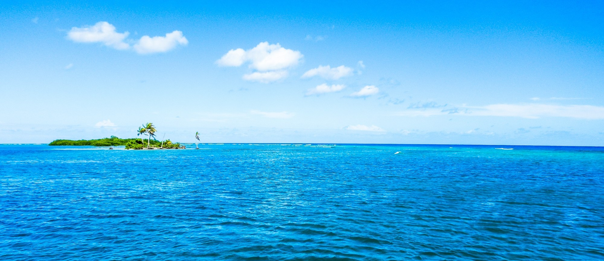

# Welcome to the UB-ERI!  

The University of Belize Environmental Research Institute (UB-ERI), founded in 2010, was established to strengthen local capacity in environmental research and monitoring. Our team conducts research, training and community engagement, providing data and insights for policymakers, conservationists, and organisations to effectively manage and protect Belize’s natural resources.

Learn more about us at https://www.uberibz.org/

To see other projects by UB-ERI staff and collaborators, check out their GitHub profiles:
- Jessica Boles ([sharp-lilac](https://github.com/sharp-lilac))
- Elsy Perez ([elsyperezz](https://github.com/elsyperezz))

 

